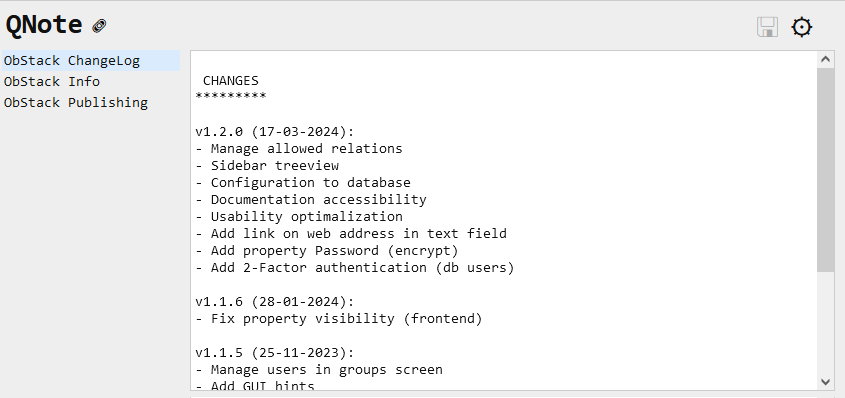
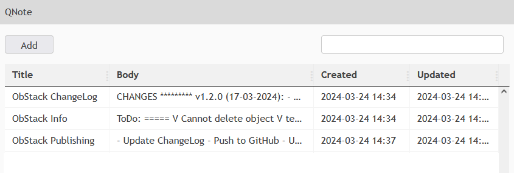

# ObStack QNote

A simple frontend-only example application for quick and easy reading and editing notes, using the ObStack backend for storage and authentication. Additionally it saves all changes to a separate ObjectType for keeping a history. 

ObStack QNote is part of the ObStack example set.

### Requirements

Using QNote will require the following setup in ObStack:

- A user with a token (preferably a dedicated user with only access to the QNote object types)
- An object type named **QNote** with at least _Create_, _Read_ and _Update_ access, and the following properties:

| Name | Type | Table |
|---|---|---|
| Title | Text | Show |
| Body | Textbox | Show |
| Created | DateTime | Show |
| Updated | DateTime | Show |

- An object type named **QNote History** with at least _Create_ and _Read_ access, and the following properties:

| Name | Type | Table |
|---|---|---|
| QNote | Select (Object Type), Source: _QNote_ | Show - Sortable |
| DateTime | DateTime | Show - Sortable|
| Body | Textbox | Show |

- Configure the API Base URL and the API Key (ObSTack Token) in the QNote WebUI by clicking on the configuration icon in the upper right corner.
- When using QNote from a different server be aware to setup CORS correctly.

### Limitations

This is an example project, however it is still usable as an application. When doing so, note these limitations:

- Creation and/or deletion of notes must be done in the ObStack WebUI
- The QNote configuration is stored in your browser local storage, and must be set separately for all different systems
- Using QNote will logout your existing ObStack session
