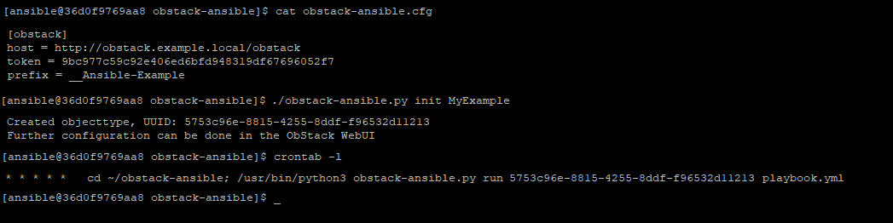
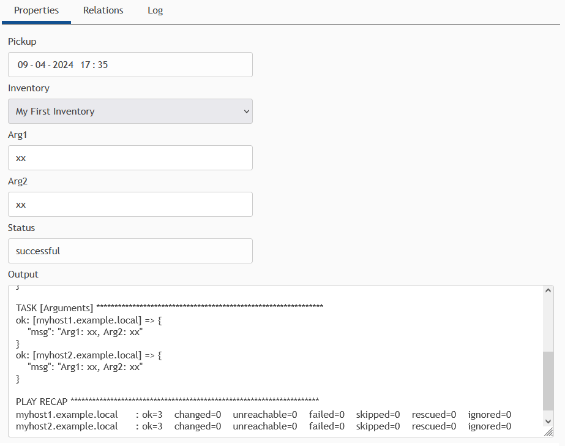

# ObStack Ansible

The ObStack Ansible script is an example script runner for Ansible playbooks. It allows ObStack users to initiate a simple predefined job through the ObStack WebUI. This script will pickup the new job, execute a playbook, and update the job/object with the script's results. For security the script communicates directly to the ObStack API and has no interface of its own, preventing the need for inbound access to your Ansible environment.

ObStack Ansible is part of the ObStack example set.

# Quick start

ObStack Ansible requires knowledge of Ansible, a working ObStack setup, and a base set of Object Types with specific fields. For a quick start take the following steps:

- **Requirements**
  - Setup an Ansible server or docker container with access to the remote hosts, as required by Ansible.
  - Setup your ObStack server as described in the ObStack installation manual
  - Configure a temporary token on a new or existing admin account
- **Setup**
  - On your Ansible server, copy or clone the ansible-obstack files to the ansible user's home directory
  - Configure the ObStack host, token and prefix in obstack-ansible.cfg
  - Setup base objects by running: _obstack-ansible.py init MyExample_
  - Store the object type UUID for usage with the _obstack-ansible.py run_ function later on
- **Configure ObStack**
  - Setup a non-admin user with a token and with permissions on the newly created object types
  - Set the token in obstack-ansible.cfg to the new token
  - Add additional data fields if required _(Field name **must** match variable name in Ansible)_
  - Create and add hosts and assign them to the Inventory object (under "Relations")
- **Configure Ansible**
  - Schedule obstack-ansible to run every minute: _obstack-ansible.py run [objecttype-uuid] [playbook.yml]_

To setup another object type for running other playbooks you can run the script again with another name. Note that when changing the prefix, the init function of the example script will not detect the existing Hosts and Inventory object types and recreate them with the new prefix.

# Manual setup

For setting up ObStack manually or add additional object types for running other playbooks the following fields are required:

**Inventory**
| Name | Type | Table |
|---|---|---|
| Inventory Name | Text | Show |

Required API access: _Read_

**Job**
| Name | Type | Source | Table | Form |
|---|---|---|---|--|
| Pickup | DateTime | | Show - Sortable | Show - Readonly |
| Inventory | Select (Object Type) | [Inventory] | Show | Show |
| Status | Text | | Show - Sortable | Show - Readonly |
| Output | Textbox | | Hide | Show - Readonly |

Required API access: _Read, Update_

